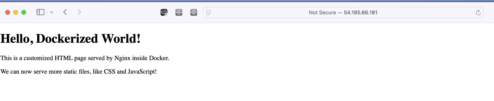

# Dockerized Nginx with Custom HTML and HTTPS Support

## Objective

This project demonstrates how to Dockerize a simple HTML page using Nginx as a web server. The project also includes support for HTTPS and Docker Compose to streamline the deployment process.

## Requirements

### 1. Basic HTML Page
- **File**: `index.html`
- Content of this file is a simple HTML page, e.g., "Hello, Docker!"
  
### 2. Nginx Configuration
- **File**: `nginx.conf`
- This file is used to configure Nginx to serve the `index.html` file on port 80 and enable HTTPS support on port 443.

### 3. Dockerfile
- **File**: `Dockerfile`
- This Dockerfile is responsible for:
  - Using an official Nginx base image.
  - Copying the `index.html` and `nginx.conf` files into the container.
  - Configuring Nginx to serve static content and enable HTTPS.

### 4. Docker Compose
- **File**: `docker-compose.yml`
- This file builds the Docker image and runs the container with Nginx serving the HTML page on both HTTP (port 80) and HTTPS (port 443).

## Folder Structure

```bash
.
├── Dockerfile
├── docker-compose.yml
├── html
│   ├── index.html
│   └── static
│       ├── style.css
│       └── script.js
├── nginx.conf
└── ssl
    ├── nginx-selfsigned.crt
    └── nginx-selfsigned.key

```
#### Files Details
- **html/index.html:** The HTML page to be served.
- **html/static/:** basic CSS and js file
- **nginx.conf:** The Nginx configuration file to serve the index.html page.
- **ssl/:** Folder containing SSL certificate and key files for HTTPS.
- **Dockerfile:** The Dockerfile to build the Docker image.
- **docker-compose.yml:** Docker Compose file to define and run the container.
- **README.md:** Documentation for the project.


### How to Build and Run the Docker Image
#### Step 1: Build the Docker Image:
```
docker build -t my-nginx-html .
```
#### Step 2: Run the Docker Container
```
docker run -d -p 80:80 -p 443:443 --name my-nginx-container my-nginx-html
```
-  -d option runs the container in detached mode.
-  -p 80:80 option maps port 80 on the container to port 80 on the host.
-  -p 443:443 option maps port 443 for HTTPS.


#### Step 3: Run with Docker Compose
```
docker compose up -d
```




## HTTPS Support
This project includes support for HTTPS using a self-signed SSL certificate. The certificate and key files are stored in the ssl/ directory.

### To Generate Self-Signed Certificates:
Generating ssl certificates 
```
openssl req -x509 -nodes -days 365 -newkey rsa:2048 -keyout ssl/nginx-selfsigned.key -out ssl/nginx-selfsigned.crt
```