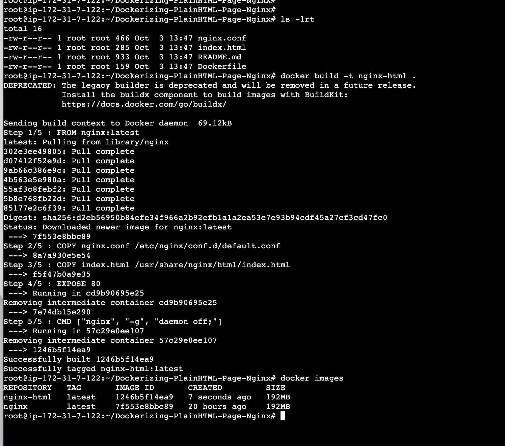
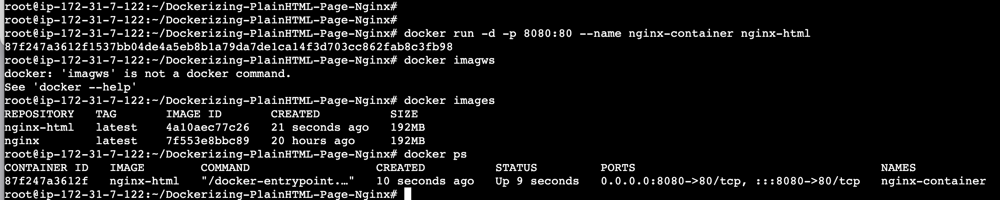
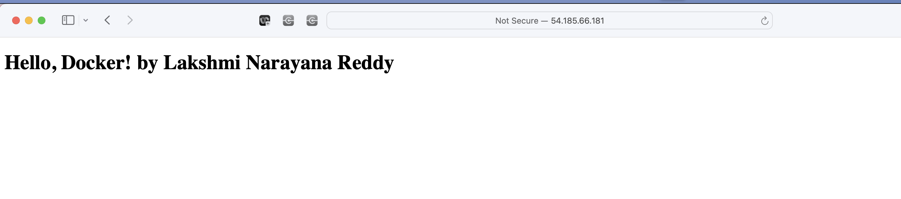
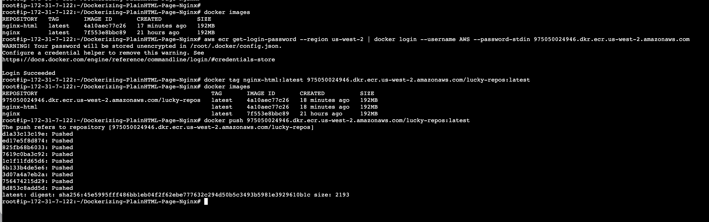

# Graded Assignment on Dockerizing a Plain HTML Page With Nginx


# Dockerized Nginx Serving HTML

This project contains a simple HTML page served using Nginx in a Docker container.


## **Files**

#### **index.html**

A plain HTML page with the content "Hello, Docker! by Lakshmi Narayana Reddy".

#### **nginx.conf**

An Nginx configuration file that serves the `index.html` page and listens on port 80.

#### **Dockerfile**

A Dockerfile that defines the Docker image. It uses an official Nginx base image, copies the `index.html` and `nginx.conf` files into the container, and ensures that the Nginx server is started when the container is run.

## **Building the Docker Image**

To build the Docker image, run the following command in the terminal:

## Steps to Build and Run

1. Build the Docker image:
    ```bash
    docker build -t nginx-html .
    ```
    

2. Run the container locally:
    ```bash
    docker run -d -p 8080:80 --name nginx-container nginx-html
    ```
   
3. Checking the Nginx with EC2 ip address:
   

Visit `http://54.185.66.181:8080/` to see the HTML page in action.

## Pushing the Image to Amazon ECR

1. **Login to ECR:** 
  ``` bash
  aws ecr get-login-password --region us-west-2 | docker login --username AWS --password-stdin 975050024946.dkr.ecr.us-west-2.amazonaws.com
  ```
2. **Tag the image:**
   ```bash
   docker tag nginx-html:latest 975050024946.dkr.ecr.us-west-2.amazonaws.com/lucky-repos:latest
   ```
3. **Push the image:**
  ```bash
  docker push 975050024946.dkr.ecr.us-west-2.amazonaws.com/lucky-repos:latest
  ```
  

[Public ECR Repo URL](https://us-west-2.console.aws.amazon.com/ecr/repositories/private/975050024946/lucky-repos/_/image/sha256:45e5995fff486bb1eb04f2f62ebe777632c294d50b5c3493b5981e3929610b1c/details?region=us-west-2)

[ECR Image URI](975050024946.dkr.ecr.us-west-2.amazonaws.com/lucky-repos:latest)

## Generate Certificates 
```
openssl req -x509 -nodes -days 365 -newkey rsa:2048 -keyout nginx-selfsigned.key -out nginx-selfsigned.crt
```